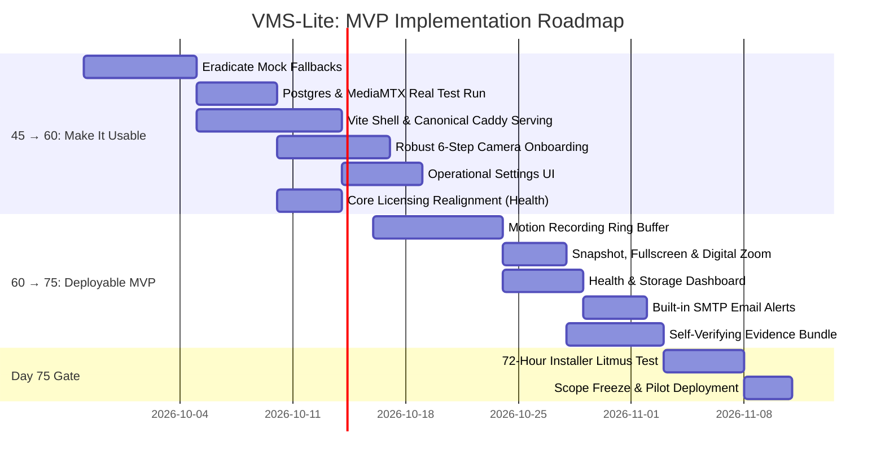

# VMS-Lite: Path to Deployable MVP (Days 45 → 75)
## Master Roadmap & Product Specification

**Document Version:** 1.0  
**Status:** Approved Architectural Baseline  
**Target Market:** Indian SMB & Residential CCTV Tier (CP Plus / Hikvision DVR/NVR Equivalent)  
**Primary Deployment Target:** Edge PC / Mini-PC Appliance / On-Premise Single-Box Server (<30 min installer setup)  

---

## Executive Summary & Core Philosophy

VMS-Lite has successfully implemented its foundational backend architecture, recording engine, playback queries, ONVIF event processing, camera health telemetry, and notification/webhook dispatchers. However, a codebase with passing unit tests against in-memory mocks is not yet a field-ready product. 

This document defines the authoritative development roadmap from **Day 45 to Day 75**, bridging the gap between *"technically implemented"* and *"an installer can deploy, configure, and trust this without engineering assistance."*

### The MVP Boundary Rule
```text
                    VMS-LITE MVP
                         │
       ┌─────────────────┼─────────────────┐
       │                 │                 │
    CAMERAS           RECORDING          OPERATIONS
       │                 │                 │
  ONVIF discover      Continuous        Health (Core!)
  Manual add          Scheduled         Storage
  Test stream         Motion            Email Alerts
  PTZ basic           Retention         WhatsApp/Webhooks
                      Pre/post buffer
       │                 │
       └────────┬────────┘
                │
             PLAYBACK
                │
       timeline / search
                │
             EXPORT
                │
     MP4 + manifest + hash
          + audit + verify
                │
              USERS
                │
          Admin / Operator
```

### The Scope Freeze & Field Gate (Day 75 Litmus Test)
At Day 75, all feature additions stop. The product must pass this single acceptance criterion:
> **Can an installer take a clean machine, install VMS-Lite, onboard 4–16 cameras, configure recording, leave it unattended for several days, experience network hiccups and motion events, retrieve footage, and export self-verifying evidence without engineering support?**
>
> If **YES** $\to$ The MVP is complete and ready for commercial field deployment.  
> If **NO** $\to$ Fix bugs and reliability issues. Under no circumstances will AI, ANPR, cloud federation, multi-site sync, or Kubernetes orchestration be added.

---

## Milestone 1: Days 45 → 60 — "Make It Usable"
**Target Duration:** 3–4 Weeks  
**Primary Objective:** Eliminate artificial mock fallbacks, prove real-world integration against PostgreSQL and MediaMTX, provide a complete React/Vite operator shell, establish verified camera onboarding, and simplify licensing.

---

### Workstream 1.1: Eradicate Mock-Fallback Fake Success
**Priority:** Highest / Non-Negotiable  
**Problem:** Several services currently catch database or network errors and fall back to in-memory maps or synthetic success responses (e.g., returning HTTP 200 with in-memory IDs when PostgreSQL or MediaMTX is unreachable). This produces "green" test runs that mask critical deployment failures.

#### Architectural Mandate: Fail Explicitly
```text
Real Dependency Fails
        ↓
Explicit Error Logged (with root-cause code & diagnostic message)
        ↓
No Misleading State Mutation (no DB row inserted, no orphaned paths)
        ↓
HTTP 4xx / 5xx with Actionable JSON Error Payload to Caller
```

#### Remediation Scope:
1. **Camera Service & Onboarding (`src/cameras/`)**:
   - If MediaMTX API is unreachable, or camera RTSP handshake fails, fail the request immediately.
   - Do not create camera DB records if the streaming path cannot be verified.
2. **Prisma Repositories (`src/recordings/`, `src/events/`, `src/webhooks/`)**:
   - Remove silent in-memory fallback branching from production runtime paths. In-memory adapters belong strictly in unit test harnesses (`mocks/`), not hidden inside domain service catch blocks.
3. **Clip Export Engine (`src/export/`)**:
   - If FFmpeg fails to spawn, source segments are missing, or target directory is read-only, mark the job as `FAILED` with explicit error output. Never return a 0-byte or placeholder MP4.
4. **License Verification (`src/licensing/`)**:
   - Expired or invalid cryptographic signatures must actively gate capability resolution rather than defaulting to permissive mode.

---

### Workstream 1.2: Full Suite Verification on Real Infrastructure
**Goal:** Transition verification from synthetic mock runs to automated integration tests against live dependencies.

#### Integration Environment Matrix:
- **Node Control Plane**: Node.js 20 LTS / Fastify
- **Database Engine**: Live PostgreSQL 16+ running with applied Prisma migrations (`npx prisma migrate deploy`)
- **Media Plane**: Live MediaMTX (v1.11+) binary running RTSP and API servers
- **Network**: Real loopback/LAN TCP sockets without sandbox `EPERM` interference

#### The Golden Installer Path Test:
An automated end-to-end integration test must verify the entire customer lifecycle:
```text
Fresh OS Environment
  ↓
Run single installer script / Docker compose
  ↓
Apply Prisma database migrations to clean PostgreSQL
  ↓
Start Fastify Control Plane + MediaMTX + Caddy
  ↓
Create initial Admin user
  ↓
Log in and receive JWT token
  ↓
Discover and onboard ONVIF test camera
  ↓
Verify MediaMTX stream path is ready and ingesting packets
  ↓
Run continuous recording for 2 minutes (verify fMP4 segments on disk)
  ↓
Query playback timeline spans via /api/playback/timeline
  ↓
Seek and fetch playback stream via /api/playback/stream
  ↓
Export a 30-second stitched MP4 clip with SHA-256 hash
  ↓
Reboot backend process / container
  ↓
Verify cameras, recordings, bookmarks, and events persist intact
```

---

### Workstream 1.3: Vite App Shell & Canonical Production Serving
**Problem:** The frontend currently consists of isolated page components and modals without a unified application router, responsive sidebar, persistent navigation layout, or unified auth session management.

#### 1. Coherent Operator Flow:
```text
LOGIN SCREEN
     ↓
MAIN APP SHELL (Top bar + Collapsible Sidebar + Status Triage)
     ├── 1. DASHBOARD (Live System Health, Storage Gauge, Quick Camera Status)
     ├── 2. LIVE VIEW (1x1, 2x2, 3x3, 4x4 Multi-Tile Grid, Sub/Main switcher, Audio, Fullscreen)
     ├── 3. PLAYBACK (24h Timeline Scrubber, Date Picker, Segment Spans, Clip Exporter)
     ├── 4. CAMERAS (Discovered list, Onboarded list, Stream Health, Add Camera Wizard)
     ├── 5. EVENTS & ALERTS (Audit log, Motion triggers, Outages, Bookmark manager)
     └── 6. SETTINGS (Recording policies, Storage retention, Email/WhatsApp, Users, Licensing)
```

#### 2. Canonical Production Serving Architecture:
To prevent architectural divergence between local development and appliance deployment, VMS-Lite establishes **Caddy** as the canonical edge reverse proxy for appliances, while keeping Fastify capable of serving built static assets in single-container mode:

```text
               APPLIANCE INGRESS (Port 80 / 443)
                              │
                    ┌─────────▼─────────┐
                    │       Caddy       │
                    └─────────┬─────────┘
         ┌────────────────────┼────────────────────┐
         │                    │                    │
   / (Static SPA)       /api & /ws          /whep & /hls
         │                    │                    │
         v                    v                    v
  Vite Production       Fastify Node          MediaMTX
  Build (/dist)         Control Plane       (Media Plane)
                        (Port 3000)          (Port 8889)
```

- **Caddyfile (Canonical Appliance)**:
  - Serves pre-built Vite assets directly with aggressive gzip/brotli caching.
  - Proxies `/api/*` and `/ws` to Fastify with WebSocket upgrade support.
  - Proxies `/whep/*` and `/hls/*` directly to MediaMTX for low-latency media delivery.
  - Automatic local self-signed TLS or Let's Encrypt certificates.
- **Fastify Static Fallback**:
  - Uses `@fastify/static` to serve `client/dist` when run in standalone development or lightweight Docker desktop setups.

---

### Workstream 1.4: Robust Camera Onboarding Pipeline
**Problem:** "Adding a camera" currently resembles a simple DB insert without guaranteeing that the camera is online, reachable, authenticated, or actively streaming.

#### The 6-Step Transactional Onboarding Wizard:
```text
Step 1: Network Discovery
  - Multicast WS-Discovery probes local subnet (ONVIF Profile T/S).
  - Displays discovered IP, MAC, manufacturer (Hikvision, CP Plus, Dahua).
  - Allows manual IP/RTSP entry fallback.
        ↓
Step 2: Authentication & Profile Resolution
  - User enters camera username & password.
  - Backend probes ONVIF `GetDeviceInformation` and `GetProfiles`.
  - Automatically identifies Main Stream (HD) and Sub Stream (Low-res for multi-grid).
        ↓
Step 3: Network & Port Verification
  - Performs TCP socket handshake to camera IP:port (default RTSP 554).
  - Validates latency and reachability before proceeding.
        ↓
Step 4: MediaMTX Path Provisioning
  - Adds RTSP pull source into MediaMTX configuration API.
  - Waits up to 5 seconds for MediaMTX to transition path state to `ready: true`.
        ↓
Step 5: Visual Stream Preview & Confirmation
  - WebRTC (WHEP) preview rendered in onboarding modal.
  - Installer visually confirms the video feed is clear and unobstructed.
        ↓
Step 6: Atomic Database Commit
  - Camera committed to PostgreSQL only after visual/streaming verification succeeds.
  - Default recording schedule and health monitoring worker immediately attached.
```

---

### Workstream 1.5: Simplified Operational Settings UI
**Problem:** Operators require clear, intuitive controls for recording policies, schedules, and storage without wrestling with low-level configuration files.

#### Settings Surface:
1. **Recording Mode**:
   - `Continuous`: Records 24/7 non-stop fMP4 segments.
   - `Motion Only`: Records rolling ring buffer promoted on ONVIF motion triggers.
   - `Scheduled`: Follows weekly calendar grid.
2. **Schedule Builder**:
   - `Always (24/7)` toggle.
   - Visual 7-day weekly grid (1-hour blocks) to define recording windows (e.g., nights & weekends).
3. **Storage Retention**:
   - Target retention dropdown: `7 Days`, `15 Days`, `30 Days`, `Custom`.
   - Clear display of current storage pool, estimated days remaining, and FIFO auto-purge policy (prunes oldest non-bookmarked segments when disk exceeds 85% utilization).

---

### Workstream 1.6: Commercial Licensing Realignment
**Problem:** Camera health monitoring was initially placed behind Package 2 (`extended.camera_health`). A surveillance system that hides whether its cameras are working behind a paid add-on is commercially unviable in the Indian SMB market.

#### The Simplified Commercial Matrix:
| Subsystem / Feature | Core (Package 1) | Pro (Package 2) | AI (Package 3) |
| :--- | :---: | :---: | :---: |
| **Live View Grid (WebRTC / HLS)** | ✓ (Up to 16 Cameras) | ✓ (Up to 64 Cameras) | ✓ (Unlimited) |
| **Continuous & Scheduled Recording** | ✓ | ✓ | ✓ |
| **24-Hour Timeline Playback** | ✓ | ✓ | ✓ |
| **ONVIF Motion Alerts & Real-time Feed** | ✓ | ✓ | ✓ |
| **Camera Health Telemetry & Diagnostics** | **✓ (Included in Core!)** | ✓ | ✓ |
| **Basic Email Notifications** | ✓ | ✓ | ✓ |
| **Hardware / Storage Rollover Pruner** | ✓ | ✓ | ✓ |
| **PTZ Controls & Presets** | — | ✓ | ✓ |
| **Motion Zone Polygon Exclusion** | — | ✓ | ✓ |
| **Evidence Export Bundle (ZIP + Verifier)** | — | ✓ | ✓ |
| **Timeline Bookmarks** | — | ✓ | ✓ |
| **WhatsApp / SMS Incident Alerts** | — | ✓ | ✓ |
| **Signed Outbound Webhooks** | — | ✓ | ✓ |
| **Edge Computer Vision / AI Analytics** | — | — | ✓ |

#### Implementation Rule:
- Relocate `extended.camera_health` into Core capability baseline.
- Retain cryptographic Ed25519 signature checks, verified at server boot, to unlock higher camera count caps and Pro features without code fragmentation.

---

## Milestone 2: Days 60 → 75 — "Complete the Deployable MVP"
**Target Duration:** 3 Weeks  
**Primary Objective:** Deliver motion-triggered recording with rolling pre/post-buffering, operator live controls, a landing dashboard, built-in email alerts, and a self-verifying evidence export bundle.

---

### Workstream 2.1: Motion Recording with Rolling Pre/Post-Buffer
**Crucial Architectural Clarification:** Motion-only recording cannot record past frames unless those frames were already being captured. An NVR cannot magically reach into the past when an ONVIF motion alert arrives.

#### The Ring-Buffer Solution (Zero-Transcode MediaMTX Architecture):
To avoid heavyweight external FFmpeg sidecars, VMS-Lite uses a **short-term rolling ring buffer** managed by MediaMTX and the `RecordingCatalog`:

```text
Camera RTSP Feed
       │
       ▼
MediaMTX Ingest (Continuous)
       │
       ▼
Short Rolling Segments (e.g., 2-second fMP4 chunks in /buffer/{cameraId}/)
       │
       ├─────────────────────────────────────────┐
       │ (FIFO pruned after 30s if no motion)   │
       ▼                                         ▼
No Motion Detected                        ONVIF Motion Event Triggered
[Segments Discarded]                             │
                                                 ▼
                                  Promotion & Preservation Engine
                                                 │
                                                 ├── 1. Capture Pre-Event Window (Past 10s from buffer)
                                                 ├── 2. Capture Active Event Duration
                                                 └── 3. Capture Post-Event Window (Next 30s)
                                                 │
                                                 ▼
                                  Promoted to Permanent Storage
                                  Cataloged in PostgreSQL recordings table
```

#### Workflow Mechanics:
1. MediaMTX writes short 2-second segments to a temporary rolling directory.
2. If no motion event arrives within 30 seconds, segments are unlinked via an in-memory FIFO queue.
3. Upon receiving `motion.detected` on the `EventBus`:
   - The engine flags the preceding 10 seconds of buffered segments.
   - All segments recorded during the active motion event are retained.
   - Recording continues for a configurable post-event cooldown window (default: 30 seconds).
   - Retained segments are atomically moved/linked to `/recordings/{cameraId}/` and registered in the database catalog.

---

### Workstream 2.2: Operator Live Controls (Snapshot, Fullscreen, Digital Zoom)
Small, high-utility UI enhancements that operators use daily:

1. **Instant Snapshot**:
   - Button on each camera tile header.
   - Grabs the current video frame via HTML5 `<canvas>` (`drawImage(videoElement)`), encodes to high-quality JPEG/PNG, and triggers immediate browser download with filename format:  
     `snapshot_{cameraName}_{YYYY-MM-DD_HH-mm-ss}.jpg`.
2. **Fullscreen Modes**:
   - Single-tile fullscreen (double-click or maximize button).
   - Multi-grid kiosk fullscreen (hides browser chrome and sidebar for security guard monitor stations).
3. **Client-Side Digital Zoom**:
   - Mouse-wheel zoom (1x to 4x) and click-and-drag pan across the active tile.
   - Implemented purely via CSS transforms (`transform: scale(...) translate(...)`) on the video viewport.
   - **Explicit Boundary**: No server-side transcode or optical PTZ command dispatching. Purely client-side viewport manipulation.

---

### Workstream 2.3: Operator Landing Dashboard (Health + Storage Overview)
**Goal:** The first screen the operator or business owner sees upon login. Answers the fundamental question: *"Is my system working and protected right now?"*

```text
┌────────────────────────────────────────────────────────────────────────────────────────┐
│  SYSTEM STATUS: HEALTHY                                         UPTIME: 14d 6h 22m     │
├──────────────────────────┬──────────────────────────┬──────────────────────────────────┤
│      CAMERA FLEET        │     RECORDING ENGINES    │         STORAGE RETENTION        │
│                          │                          │                                  │
│   ● 14 Online            │   ● 14 Active            │   [██████████████░░░░] 78%       │
│   ▲  1 Degraded          │   ○  0 Scheduled Pause   │   1.8 TB Used / 2.3 TB Total     │
│   ■  0 Offline           │   ■  1 Motion Standby    │   12.4 Days Est. Retention       │
│                          │                          │   Auto-Purge Target: 85% (FIFO)  │
├──────────────────────────┴──────────────────────────┴──────────────────────────────────┤
│  RECENT EVENTS & ALERTS (LAST 24 HOURS)                                                │
│  [01:14] Main Gate    - Motion Detected (Inclusion Zone 1)                             │
│  [00:42] Warehouse    - Camera Degraded (High Network Latency: 620ms)                  │
│  [Yesterday] Backyard - Camera Recovered to Online (Outage Duration: 42s)              │
└────────────────────────────────────────────────────────────────────────────────────────┘
```

#### Metrics Tracked:
- **Cameras**: Active count breakdown across `ONLINE`, `DEGRADED`, `OFFLINE`, and `UNKNOWN`.
- **Recording Status**: Count of cameras actively writing video frames versus on standby.
- **Storage Pool**: Total capacity, used space, percentage utilization bar, and dynamic calculation of effective retention days based on rolling 24h byte ingestion rate.

---

### Workstream 2.4: Built-in SMTP Email Alerting
**Problem:** Third-party cloud APIs (such as WhatsApp Cloud API or Twilio) require internet connectivity, business verification, credit cards, and periodic token refresh. SMB installations require a zero-cost, direct alerting channel that works immediately.

#### Implementation:
- In-process SMTP dispatcher subscribing to `EventBus` (`motion.detected`, `camera.offline`, `storage.warning`).
- Configurable in Settings: SMTP Host, Port, TLS/STARTTLS, Username, Password, Sender, and Recipient list.
- Formats rich HTML alerts with IST timestamps, camera details, trigger reason, and deep-link back to the timeline playback event.
- Rate-limited via the existing `TokenBucketRateLimiter` to prevent email inbox flooding.

---

### Workstream 2.5: Self-Verifying Evidence Export Package
**Problem:** Exporting a raw `.mp4` file is insufficient when presenting evidence to police, insurance adjusters, or court officials. Anyone can claim the video was edited or altered.

#### The Defensible Evidence Bundle Structure:
Exporting an incident clip produces a signed `.zip` bundle structured as follows:

```text
EVIDENCE_EXPORT_{exportId}_{timestamp}.zip
├── video.mp4               (Raw stitched stream-copy video)
├── manifest.json           (Cryptographic export manifest)
├── audit.json              (Audit trail & user identity record)
└── verify.js               (Zero-dependency standalone verification script)
```

#### 1. `manifest.json`:
```json
{
  "version": "1.0",
  "exportId": "exp-8f3b2a-491c",
  "cameraId": "cam-warehouse-01",
  "cameraName": "Warehouse North Entry",
  "startTime": "2026-09-27T00:30:00.000Z",
  "endTime": "2026-09-27T00:35:00.000Z",
  "durationSeconds": 300,
  "generatedAt": "2026-09-27T01:15:00.000Z",
  "requestedBy": {
    "userId": "usr-admin-1",
    "username": "admin",
    "role": "ADMIN"
  },
  "files": [
    {
      "filename": "video.mp4",
      "sha256": "e3b0c44298fc1c149afbf4c8996fb92427ae41e4649b934ca495991b7852b855",
      "sizeBytes": 42158900
    }
  ]
}
```

#### 2. `audit.json`:
Contains server environment details, node software version, local IP, client IP that requested the export, and timeline bookmarks active during the clip window.

#### 3. `verify.js` (Standalone Verifier):
A portable, zero-dependency Node.js script included in the ZIP. Anyone with Node.js installed can verify evidence integrity in 2 seconds:
```bash
node verify.js
```
**Verifier Output:**
```text
[VERIFY] Reading manifest.json... OK
[VERIFY] Reading video.mp4 (42,158,900 bytes)... OK
[VERIFY] Calculating SHA-256 checksum...
[VERIFY] Calculated: e3b0c44298fc1c149afbf4c8996fb92427ae41e4649b934ca495991b7852b855
[VERIFY] Expected:   e3b0c44298fc1c149afbf4c8996fb92427ae41e4649b934ca495991b7852b855
[RESULT] INTEGRITY VERIFIED: Video has not been modified or tampered with.
```

---

## The Day 75 Scope Freeze & Installer Litmus Test

On Day 75, feature development is strictly frozen. The release candidate enters the **Installer Acceptance Test**:

```text
                           DAY 75 ACCEPTANCE GATE
                                     │
                 ┌───────────────────┴───────────────────┐
                 │                                       │
         PASSES CRITERIA                        FAILS ANY STEP
                 │                                       │
                 ▼                                       ▼
       MVP DEPLOYMENT READY                   STABILIZATION SPRINT
       (Begin Customer Pilots)                (Bug fixes only; no features)
```

### The Acceptance Protocol:
1. **Hardware**: Dedicated budget hardware (Intel N100 / 8GB RAM / 1TB SATA SSD / Ubuntu 24.04 LTS or Debian 12).
2. **Cameras**: 4 to 16 mixed ONVIF cameras (Hikvision, CP Plus, Dahua).
3. **Execution**:
   - Automated single-command installation runs to completion in $< 30$ minutes.
   - Installer logs into Web UI via local browser.
   - Onboards all cameras via discovery wizard with video preview confirmation.
   - Configures continuous recording on 8 cameras and motion-buffered recording on 8 cameras.
   - System left running unattended for **72 consecutive hours**.
   - Pull network cable on Camera 3 $\to$ verify status transitions to `DEGRADED` then `OFFLINE` (at 30s) $\to$ email alert received.
   - Plug network cable back in $\to$ verify camera recovers to `ONLINE` and recovery event logs exact downtime.
   - Walk in front of motion camera $\to$ verify rolling pre-buffer (10s) + event + post-buffer (30s) is cataloged.
   - Scrub playback timeline across all 16 cameras simultaneously.
   - Export an evidence clip $\to$ run `verify.js` $\to$ verify checksum passes.
4. **Hard Out-of-Scope Enforcement**:
   - No cloud subscriptions required.
   - No Kubernetes / Docker Swarm complexity.
   - No AI / ANPR / Face Recognition.
   - No multi-tenant enterprise hierarchy.

---

## Roadmap Summary & Timeline



| Phase | Milestone | Focus Areas | Deliverables |
| :--- | :--- | :--- | :--- |
| **Days 45–60** | **Make It Usable** | True failure handling, Postgres E2E tests, Vite App Shell, Caddy/Fastify serving, Camera Onboarding Wizard, Core Licensing with Health. | Usable web application with guaranteed persistence and verified hardware onboarding. |
| **Days 60–75** | **Deployable MVP** | Motion recording with pre/post-buffering, Live snapshot/zoom controls, Landing dashboard, SMTP alerts, Evidence export bundle. | Commercially deployable NVR replacement with defensible evidence and zero external cloud dependencies. |
| **Day 75+** | **Field Validation** | 72-hour installer acceptance test, bug fixes, real-world deployment hardening. | Formal v1.0.0 Production Release. |
